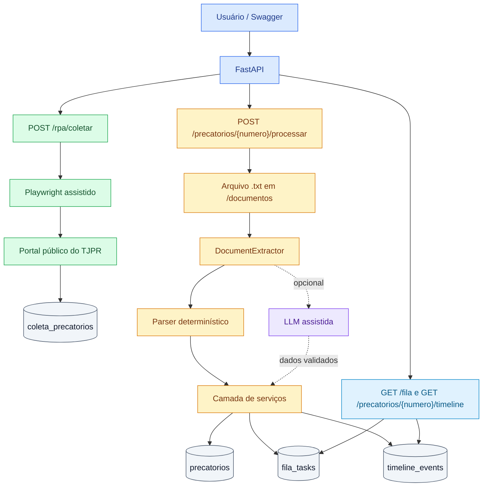

# Decisões técnicas

Este documento registra as principais decisões tomadas na implementação do desafio. A intenção foi manter a solução simples o suficiente para avaliação local, mas com separação de responsabilidades, persistência auditável e pontos claros de extensão.

## Objetivo da arquitetura

Organizei o projeto em camadas pequenas:

- `src/main.py`: inicialização da API.
- `src/routers/`: endpoints HTTP.
- `src/services.py`: regras de aplicação.
- `src/document_extraction.py`: contrato de extração e ponto de extensão para LLM.
- `src/document_parser.py`: extração e classificação dos documentos OCR.
- `src/models.py`: modelos SQLAlchemy.
- `src/schemas.py`: contratos Pydantic.
- `src/rpa.py`: coleta assistida com Playwright.

Essa divisão evita que as rotas concentrem regra de negócio e facilita a troca futura do SQLite por outro banco, como PostgreSQL, por exemplo.

## Taxonomia de status

Defini cinco estados para normalizar as variações encontradas nos textos:

- `AGUARDANDO_PAGAMENTO`: precatório inscrito, com posição de fila ou previsão orçamentária, sem indício de bloqueio.
- `SUSPENSO`: decisão, liminar, pendência documental ou outra condição que impede o pagamento normal.
- `PAGO`: quitação, pagamento integral, baixa por pagamento ou crédito extinto por pagamento.
- `CANCELADO`: cancelamento, anulação ou perda de efeito sem indicação de pagamento.
- `REVISAO_NECESSARIA`: documento sem status explícito, com ambiguidade crítica, negação jurídica ou sinais conflitantes que impedem uma classificação segura por regras.

A regra de classificação trata documentos como `0051203-09.2021.8.16.0000.txt` como `SUSPENSO` quando eles forem processados pela API. Embora esse texto use “em processamento”, a pendência documental e a necessidade de regularização bloqueiam o fluxo de pagamento; por isso, esse caso é interpretado como uma suspensão operacional.

O status `REVISAO_NECESSARIA` foi incluído para evitar decisões operacionais incorretas quando o texto não traz status explícito ou contém negações, como “não há decisão de cancelamento” ou “sem comprovante de pagamento”. Nesses casos, o sistema não deve classificar apenas pela presença isolada da palavra `cancelamento`, `pagamento` ou `suspensão`, nem assumir que o caso está em fila por falta de evidência contrária; ele sinaliza baixa confiança e recomenda revisão por IA ou análise manual.

A taxonomia adotada é propositalmente macro e operacional. Estados mais granulares, como expedido, incluído na LOA, fila cronológica, prioridade, superpreferência, acordo direto e cessão de crédito, não foram tratados como status principais nesta versão porque podem coexistir com o estado de aguardando pagamento. Em uma evolução de produção, esses conceitos seriam modelados como `fase_processual` ou marcadores complementares, mantendo o status principal voltado para a decisão operacional da fila.

## Regras da fila

A fila foi desenhada como uma fila operacional de acompanhamento e saneamento dos precatórios, não como ranking comercial de aquisição de crédito.

A fila usa prioridade numérica crescente: quanto menor o número, maior a urgência.

- Prioridade 1: `REVISAO_NECESSARIA` gera `REVISAR_CLASSIFICACAO`.
- Prioridade 2: `SUSPENSO` gera `ACOMPANHAR_SUSPENSAO`.
- Prioridade 3: `AGUARDANDO_PAGAMENTO` gera `MONITORAR_PAGAMENTO`.
- Prioridade 4: `CANCELADO` gera `AUDITAR_CANCELAMENTO`.
- Prioridade 5: `PAGO` gera `CONCILIAR_PAGAMENTO`.

O critério privilegia, primeiro, documentos que exigem revisão, porque uma classificação errada contaminaria fila, timeline e próximas ações. Em seguida, aparecem casos bloqueados, precatórios aguardando pagamento, cancelamentos que precisam de auditoria e, por último, pagamentos já identificados para conciliação.

## Coleta automatizada

Usei Playwright com `headless=False` no endpoint `POST /rpa/coletar`. Essa decisão permite que o captcha seja resolvido manualmente no navegador aberto, sem bypass automatizado. Depois da pesquisa, a aplicação lê a tabela de resultados e persiste os números de precatórios disponíveis, preservando a ordem encontrada.

O payload do endpoint permite informar o `ente_devedor` desejado, por exemplo `CURITIBA` ou `Estado do Parana`. Com esse valor, o RPA tenta selecionar automaticamente o `Órgão Devedor` correspondente no portal antes da etapa manual. Depois disso, a interação esperada é manter ou ajustar a quantidade de itens em `Página`, preencher o texto da imagem de verificação e clicar em `Pesquisar`. O campo `N. Precatório/Processo` deve ficar vazio quando a coleta desejada for a fila geral.

Essa seleção automática ocorre apenas se o portal expuser o campo como um `select` HTML simples. Caso o componente seja renderizado como dropdown customizado, ou caso o texto informado no payload não corresponda a nenhuma opção, a seleção fica explicitamente manual. Essa escolha reduz a fragilidade da automação e evita acoplamento excessivo a detalhes visuais do portal.

Depois que a listagem aparece, o RPA não faz varredura livre no texto da página. Ele localiza a tabela de resultados, identifica a coluna `Autos do Precatório` e tenta extrair números CNJ completos dessa coluna. Quando o CNJ vem mascarado, o RPA usa a coluna `Ofício Precatório` como identificador público disponível. O código remove duplicidades, preserva a ordem e salva somente esses identificadores. Nenhum outro dado do portal é persistido nessa etapa.

Essa escolha permite demonstrar a coleta real da fila pública mesmo quando o portal anonimiza o CNJ em `Autos do Precatório`, por exemplo `000xxxx-95.xxxx.8.16.7000`.

Existe uma limitação intencional: os documentos locais do desafio estão nomeados por número CNJ completo, enquanto o portal público pode expor apenas o `Ofício Precatório`, em formato como `2024/906061`. Nessa situação, a coleta continua sendo persistida para evidenciar a ordem cronológica oficial, mas a resposta traz aviso de que o processamento documental local depende do CNJ do arquivo em `/documentos`. Em produção, uma evolução natural seria usar uma exportação oficial ou tela de detalhe autorizada para relacionar `Ofício Precatório` e CNJ sem inferência artificial.

## Persistência

Escolhi SQLite para simplificar a execução local do desafio. As tabelas foram separadas por responsabilidade:

- `precatorios`: estado estruturado atual de cada precatório.
- `coleta_precatorios`: números coletados na ordem cronológica original.
- `fila_tasks`: tarefas pendentes ou futuras.
- `timeline_events`: eventos auditáveis de coleta, extraídos dos documentos ou recebidos por API.

SQLAlchemy foi usado para manter portabilidade para PostgreSQL ou outro banco relacional em uma evolução posterior.

Para a entrega local, o schema é criado diretamente a partir dos modelos SQLAlchemy com `Base.metadata.create_all()`. Não há alteração dinâmica de colunas no startup. Em produção, a evolução de schema seria feita com Alembic ou ferramenta equivalente de migração versionada.

## Linha do tempo

A timeline combina eventos da coleta RPA, eventos extraídos do texto original e eventos cadastrados posteriormente pela API. Quando a coleta retorna CNJ completo, o sistema registra `COLETA_RPA` com origem `rpa` e a posição encontrada na listagem pública. Quando a coleta retorna apenas `Ofício Precatório`, esse identificador permanece em `coleta_precatorios`, sem criar evento de timeline, porque a associação segura com o CNJ completo depende de fonte oficial não mascarada. Quando a data não tem precisão completa, o evento registra `ano`, `mes` ou `desconhecida`, evitando apresentar informação estimada como se fosse uma data exata.

Datas inválidas vindas de OCR, como `31/02/2020`, não interrompem o processamento. O parser ignora a data inválida, registra um aviso em `extraction_warnings` e mantém o restante do documento processável. A decisão evita erro 500 por sujeira de OCR e preserva rastreabilidade para revisão posterior.

CPF e CNPJ extraídos dos documentos também passam por validação de dígito verificador. Como a massa do desafio usa dados simulados, o sistema preserva o valor textual encontrado e registra inconsistências como aviso em `extraction_warnings`, em vez de descartar silenciosamente a informação do OCR.

## Preparação para LLM

A versão atual usa parser determinístico por regras como caminho principal apenas considerando o escopo deste desafio: os documentos de entrada são `.txt`, a massa é pequena e a avaliação pede uma solução simples, auditável e reproduzível. Em um uso real, em produção ou em maior escala, o ideal seria tratar a LLM como parte central da extração, com prompts bem definidos, saída estruturada, validação por schema, evidências textuais obrigatórias e regras de domínio para impedir inferências sem base no documento.

Para deixar esse caminho preparado sem tornar a entrega dependente de credenciais externas, implementei uma camada de extração separada em `src/document_extraction.py`, com LLM opcional atrás de variável de ambiente.

Essa camada possui:

- `DocumentExtractor`: contrato comum para qualquer extrator.
- `RuleBasedDocumentExtractor`: implementação atual.
- `LlmAssistedDocumentExtractor`: extrator assistido por LLM, ativado apenas quando configurado.
- `HybridDocumentExtractor`: orquestrador preparado para usar regras primeiro e acionar LLM quando a confiança for baixa.

O resultado da extração salva metadados no precatório: método usado, nível de confiança, avisos e `llm_recommended`. Quando `llm_recommended` é verdadeiro, a API não bloqueia o fluxo nem inventa dados; ela persiste o resultado determinístico disponível e sinaliza que uma revisão por IA seria recomendada em produção.

A chamada real à LLM foi deixada atrás de um controlador por variável de ambiente. Por padrão, `LLM_ENABLED` fica desligado. Quando ativado, o sistema usa endpoint OpenAI-compatible, com Groq como configuração padrão (`https://api.groq.com/openai/v1`), e só chama a IA quando a extração por regras indica baixa confiança.

O uso de LLM segue resposta estruturada, validação por schema e persistência apenas após validação. A LLM não grava diretamente no banco nem substitui as regras de negócio da aplicação; ela atua como auxiliar de extração quando o texto jurídico foge dos padrões conhecidos. Se a chamada falhar, o resultado determinístico por regras é mantido e o erro é registrado em `extraction_warnings`.

## Fora de escopo consciente

- Autenticação e autorização, porque o desafio não pede controle de acesso.
- Worker real para consumir a fila, porque o escopo solicitado é inserir e consultar tarefas.
- OCR real, já que os arquivos de entrada simulam o texto OCR.
- LLM ligada por padrão, porque exigiria credenciais externas e rede durante avaliação local. A integração ficou pronta, mas opt-in.
- Migrações versionadas com Alembic, porque o desafio usa SQLite local e o schema é criado a partir dos modelos SQLAlchemy. Em produção, a evolução do banco deveria ser controlada por migrations.
- Enriquecimento automático entre `Ofício Precatório` e número CNJ completo, porque o portal público exibe os autos de forma mascarada. A associação segura dependeria de fonte oficial não anonimizada, exportação autorizada ou cadastro interno.
- Automações que contornem a verificação de texto/captcha do portal. O TJPR exige interação humana nessa etapa antes da pesquisa, e a solução foi desenhada como coleta assistida para não burlar mecanismos antifraude, reduzir risco de bloqueio por IP e manter o acesso compatível com o uso esperado do portal público.

## Visão geral da implementação

A implementação foi desenhada para cobrir o pipeline proposto no desafio de forma pragmática: coletar a fila pública do TJPR sem burlar mecanismos do portal, processar documentos OCR simulados com regras auditáveis, classificar o status em uma taxonomia operacional, gerar tarefas futuras coerentes com essa classificação e manter uma linha do tempo rastreável para cada precatório.

A solução privilegia previsibilidade, segurança e rastreabilidade. Por isso, decisões potencialmente arriscadas, como inferir a relação entre `Ofício Precatório` e CNJ mascarado ou automatizar captcha, foram evitadas. Ao mesmo tempo, deixei pontos de evolução claros para um cenário produtivo, como LLM assistida, migrações versionadas, enriquecimento por fonte oficial e substituição do SQLite por banco relacional mais robusto.
